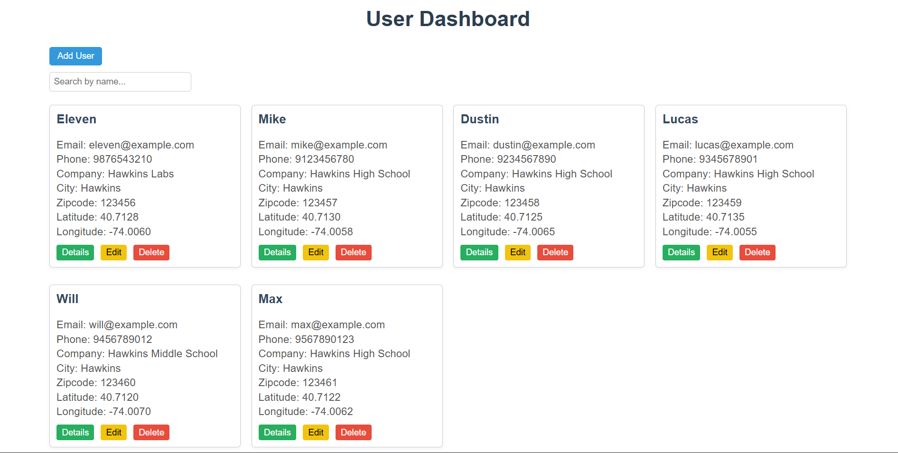
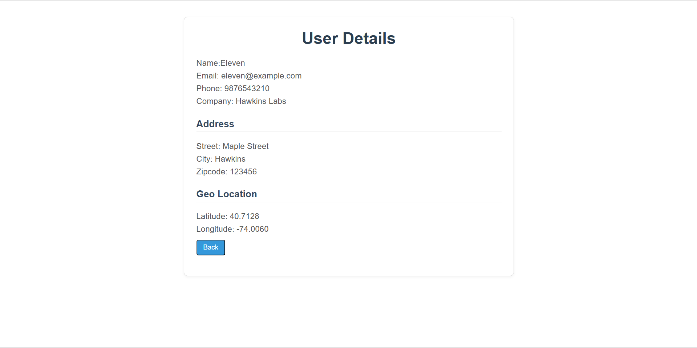
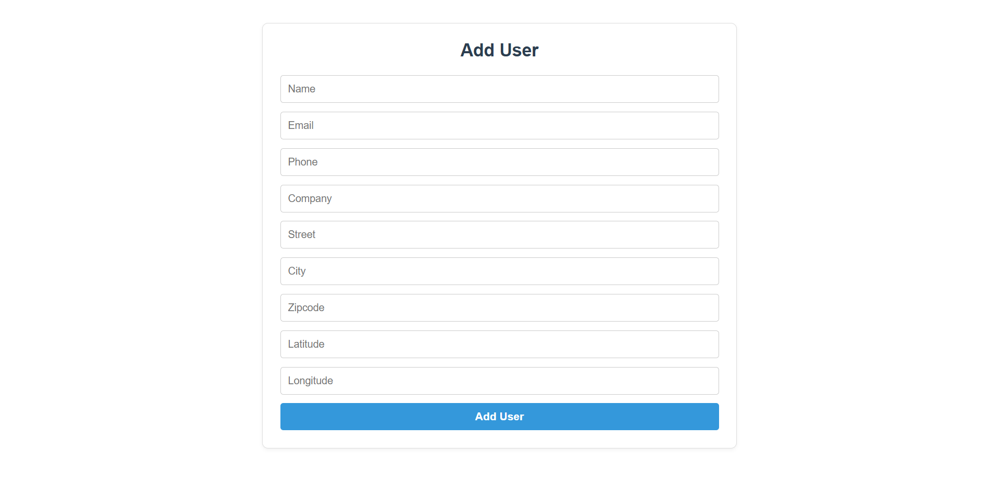

# User Management Dashboard

A full-stack web application to manage users with CRUD operations (Create, Read, Update, Delete).  
Built using **React.js** for the frontend and **Node.js + Express** for the backend, connected to **SQLite** database.

---

## Project Structure

user_management_dashboard/
│
├── frontend/ # React frontend code
│ ├── components/ # UserForm, UserList, UserDetails
│ ├── pages/ # DashboardPage, UserDetailsPage
│ ├── context/ # UserContext for global state
│ ├── api/ # Axios API requests (userService.js)
│ └── index.css # Styling
│
├── backend/ # Node.js + Express backend
│ ├── routes/ # API routes for users
│ ├── database.js # SQLite database setup
│ └── server.js # Express server
│
└── README.md # Project documentation

yaml
Copy code

---

## Tech Stack

**Frontend:** React.js (functional components + hooks), React Router, Axios, plain CSS  
**Backend:** Node.js, Express.js  
**Database:** SQLite  
**Styling:** Plain CSS  

---

## Features

### Frontend

- Dashboard to view list of users
- Add new user via a form
- View user details
- Edit existing users
- Delete users
- Client-side validation (required fields and valid email)
- Search/filter users by name
- Responsive UI with basic styling

### Backend

- RESTful API endpoints:
  - `GET /api/users` → Return all users
  - `GET /api/users/:id` → Return user by ID
  - `POST /api/users` → Create new user
  - `PUT /api/users/:id` → Update existing user
  - `DELETE /api/users/:id` → Delete user
- Server-side validation for required fields and email format
- Error handling for invalid data or user not found

---

## Deployment on Render

### Frontend Link:https://user-management-dashboard-1-i2mr.onrender.com/
### Backend Link :https://user-management-dashboard-os2g.onrender.com/

## Screenshots

### 
### 
### 

## Usage

-Open the Dashboard to see all users

-Add a new user using the Add User button

-Edit a user by clicking the Edit button

-View user details by clicking Details

-Delete a user using the Delete button

-Search users by name using the search input
